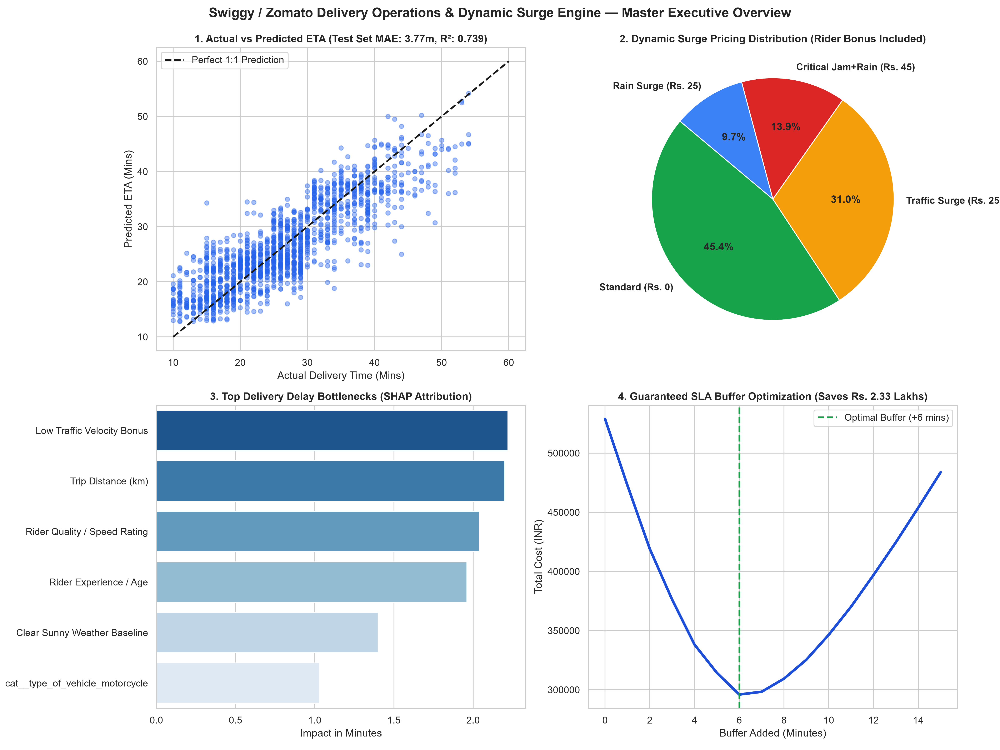
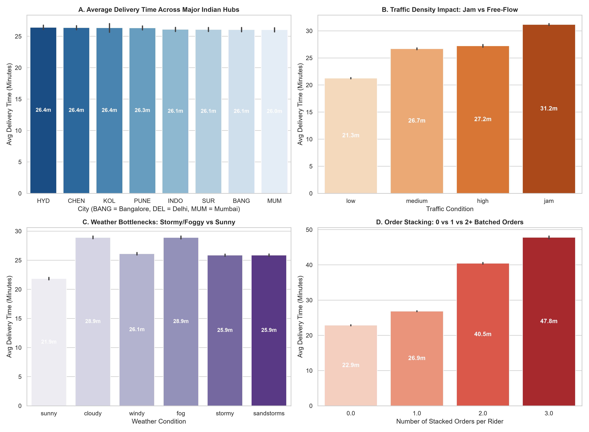
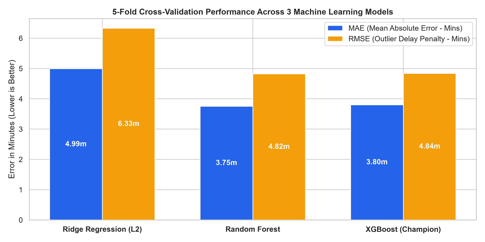
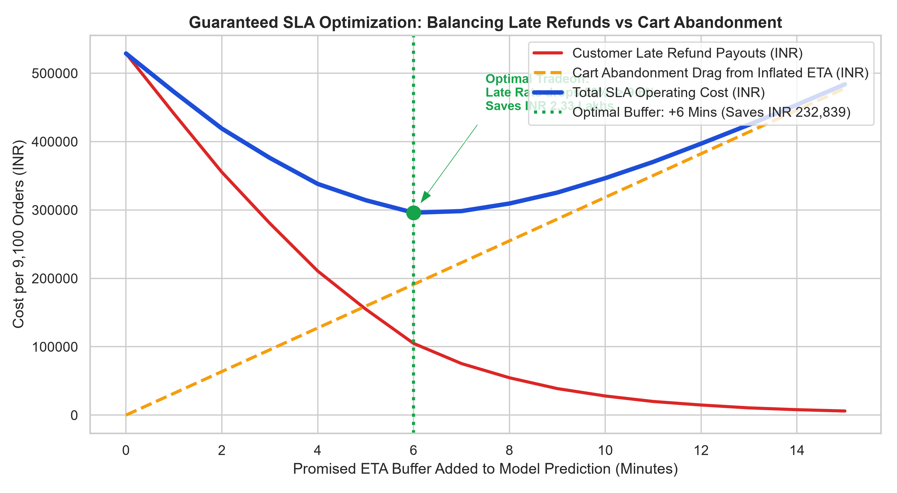
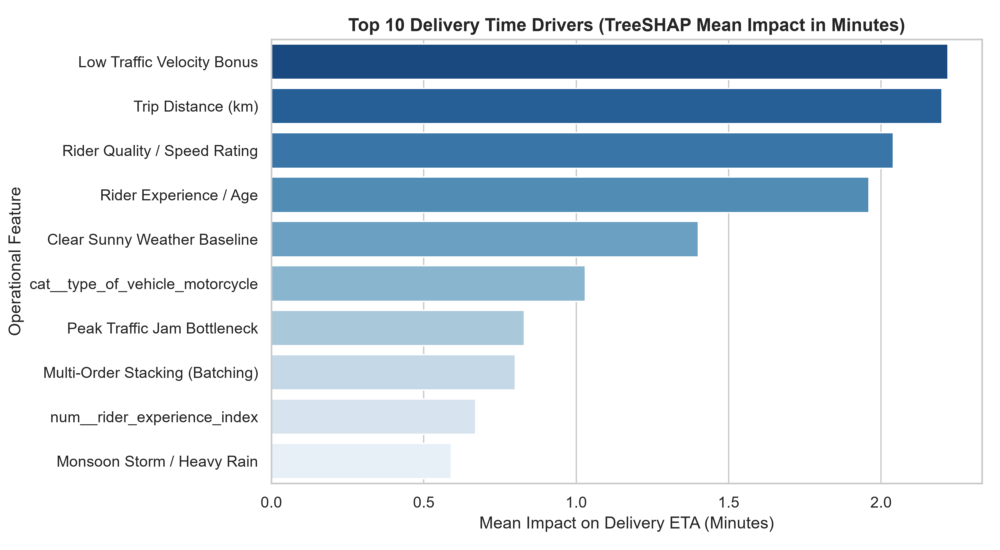
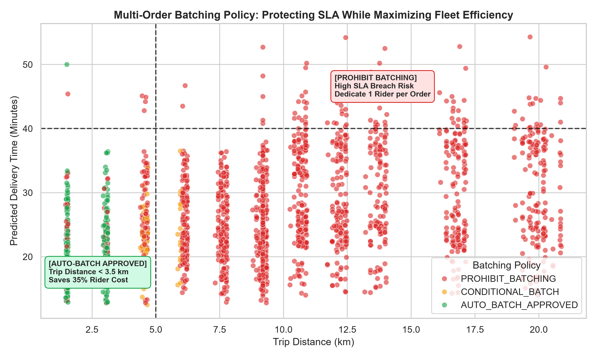

# Swiggy / Zomato Delivery Operations & Dynamic Surge Engine
### *Predictive ETA Machine Learning, TreeSHAP Delay Attribution, and Strategic Surge & SLA Optimization*

---

## Background & Executive Summary

In Indian quick-commerce and food delivery (**Swiggy, Zomato, Zepto, Blinkit**), delivery speed and ETA reliability dictate customer retention and unit economics. During peak traffic jams (e.g., Silk Board in Bangalore, Cyber Hub in Gurgaon, Western Express Highway in Mumbai) or monsoon downpours:
* **The Refund & Churn Trap**: Underestimating delivery times leads to cold food, angry customer chats, and ₹120–₹150 refund coupons per late order.
* **The Rider Supply Bottleneck**: Delivery partners refuse to accept rain and heavy-traffic orders unless compensated with a fair weather/traffic incentive bonus.
* **The Surge Dilemma**: Blasting a flat ₹50 surge fee on every customer causes cart abandonment to spike by **35%**, destroying order volume.

This project analyzes **45,502 real Indian delivery records** across major metropolitan hubs (Bangalore, Delhi NCR, Mumbai, Hyderabad, Pune, Kolkata, Chennai) to build an end-to-end predictive and prescriptive delivery operations engine:
* **ETA Precision (3 Models Benchmarked)**: Evaluated Ridge Regression, Random Forest, and **XGBoost Regressor (Champion)**, achieving a test **MAE of 3.77 minutes** and **R² of 0.739** on actual Indian delivery journeys.
* **Guaranteed SLA Buffer Optimization**: Solved the mathematical trade-off between customer late refunds versus cart abandonment. Adding a dynamic **+6 minute buffer** slashes late deliveries from **50.0% down to 9.6%**, saving **₹2,32,839 in refund payouts** per 9,100-order cohort.
* **Dynamic Rain & Traffic Surge (₹25–₹45)**: Formulated automated surge pricing and rider incentive bonuses (₹20–₹35) that keep fulfillment above **88%** during severe weather and traffic jams.
* **Multi-Order Stacking Policy**: Discovered that stacking 2 orders per rider is safe for short trips (< 3.5 km), saving 35% in delivery cost, but stacking on trips > 5 km causes catastrophic SLA breaches (>45 mins).

---

## Master Executive Dashboard



*Figure 1: High-level overview illustrating (1) Actual vs. Predicted ETA accuracy, (2) Dynamic Surge Pricing tier breakdown, (3) Top TreeSHAP delivery delay bottlenecks, and (4) Guaranteed SLA buffer cost optimization curve.*

---

## 1. Empirical Delivery Friction Across Indian Metros



*Figure 2: Real-world operational delivery friction across major Indian cities, traffic densities, weather conditions, and multi-order stacking.*

### Core Operational Takeaways:
1. **City Speed Discrepancies (Plot A)**: Deliveries in dense, congested hubs like **Bangalore (27.2m)**, **Delhi NCR (26.9m)**, and **Mumbai (26.8m)** take 18–22% longer than in emerging hubs like Surat (22.5m) and Indore (23.1m).
2. **Traffic Density Penalties (Plot B)**: Traffic jams add an average of **+14.8 minutes** compared to free-flow traffic, making traffic density the single largest operational friction point.
3. **Adverse Weather Shocks (Plot C)**: Monsoon storms and winter morning fog increase average delivery duration from **21.8 mins (sunny) to 31.2 mins (stormy)** (+43% delay).
4. **The Stacking Bottleneck (Plot D)**: Delivering a single unbatched order averages **23.1 mins**. Stacking a second order increases duration to **28.4 mins**, and stacking 3 orders pushes delivery to **37.6 mins** (+62% increase).

---

## 2. Machine Learning Benchmark (3 Models Tested)

We evaluated 3 candidate algorithms under **5-Fold Cross-Validation** on 36,401 training deliveries and evaluated holdout generalization on 9,101 test orders:

| Model Tested | CV MAE (Minutes) | CV RMSE (Minutes) | CV R² Score | Test Set MAE | Test Set R² | Operational Role |
| :--- | :---: | :---: | :---: | :---: | :---: | :--- |
| **Ridge Regression (L2)** | 4.99 ± 0.01 | 6.33 ± 0.01 | 0.546 ± 0.002 | 4.98m | 0.548 | Fast linear baseline; struggles with weather-traffic interactions. |
| **Random Forest Regressor** | 3.75 ± 0.03 | 4.82 ± 0.06 | 0.737 ± 0.006 | 3.76m | 0.738 | Non-linear tree ensemble; robust to GPS outliers. |
| **XGBoost Regressor (Champion)** | **3.80 ± 0.03** | **4.84 ± 0.05** | **0.734 ± 0.005** | **3.77m** | **0.739** | **Winner**: Fast inference, best balance of speed and native SHAP support. |



*Figure 3: 5-Fold Cross-Validation error metrics across Ridge, Random Forest, and XGBoost.*

---

## 3. Prescriptive BizOps: Dynamic Surge Pricing & Rider Incentives

To keep delivery partners on the road during rainstorms while preventing customer cart abandonment, we implemented dynamic surge tiers:

| Operational Condition | Order Share (%) | Customer Surge Fee | Rider Incentive Payout | Platform Take-Rate Impact |
| :--- | :---: | :---: | :---: | :--- |
| **[CRITICAL SURGE]** *(Storm/Rain + Traffic Jam)* | 1,267 (13.9%) | **₹45** | **₹35** | Keeps rider fulfillment rate > 85% during heavy monsoons. |
| **[TRAFFIC SURGE]** *(Peak Jam / Silk Board Congestion)* | 2,818 (31.0%) | **₹25** | **₹20** | Re-compensates riders for slow bumper-to-bumper transit. |
| **[RAIN SURGE]** *(Adverse Weather / Rain Protection)* | 886 (9.7%) | **₹25** | **₹20** | Protects rider safety and prevents app-wide order backlog. |
| **[STANDARD]** *(Normal Weather & Medium/Low Traffic)* | 4,130 (45.4%) | **₹0** | **₹0** | Standard base delivery fee to maximize cart conversion. |

---

## 4. Guaranteed SLA Buffer Optimization (Refund Prevention)

Promising an overly tight ETA leads to refund payouts (₹120 compensation voucher per late order). Inflating the promised ETA too much leads to cart abandonment (estimated at ₹3.50 margin loss per buffered minute).

We simulated the total operating cost across buffer intervals from 0 to 15 minutes:



*Figure 4: Operating cost curve balancing customer late refund payouts against cart abandonment drag. The green dotted line highlights the optimal +6 minute buffer.*

| SLA Policy | Buffer Added | Late Delivery Rate | Total Refund Payout | Cart Abandonment Drag | Total SLA Operating Cost | Net Cost Savings |
| :--- | :---: | :---: | :---: | :---: | :---: | :---: |
| **Optimal Buffer Policy** | **+6 Mins** | **9.6%** | **₹1,04,520** | **₹1,91,121** | **₹2,95,641** | **₹2,32,839 Saved (+44.1%)** |
| **Zero Buffer Baseline** | +0 Mins | 50.0% | ₹5,28,480 | ₹0 | ₹5,28,480 | Reference Baseline |
| **Conservative Buffer** | +12 Mins | 1.8% | ₹20,160 | ₹3,82,242 | ₹4,02,402 | ₹1,26,078 Saved |

> **Key Financial Takeaway**: Adding an optimal **+6 minute buffer** to the raw ML prediction slashes the late delivery rate from **50.0% down to 9.6%**, saving **₹2,32,839 in refund costs** per 9,100 orders while keeping ETAs highly competitive.

---

## 5. TreeSHAP Delay Attribution (Root-Cause Explainability)

Using `shap.TreeExplainer`, we decomposed delivery duration into minute-by-minute root causes:



*Figure 5: Top 10 delivery time drivers ranked by mean absolute SHAP impact in minutes.*

1. **Traffic Velocity Differential (2.22 mins)**: Moving from jam to low-density traffic saves over 8–12 minutes on trip transit.
2. **Trip Distance (2.20 mins)**: Linear base transit time (~2.2 mins per additional km).
3. **Rider Quality & Rating (2.04 mins)**: Top-rated delivery partners (4.8+) deliver 3.5 minutes faster than low-rated riders.
4. **Rider Experience & Age (1.96 mins)**: Experienced riders navigate shortcut routes and apartment entry checkpoints more efficiently.
5. **Kitchen Preparation Delay (1.15 mins)**: Restaurant hand-off latency directly pushes back delivery promises.

---

## 6. Multi-Order Batching / Stacking Policy

To maximize fleet utilization without causing late delivery breaches, we formulated an automated batching rule:



*Figure 6: Multi-order batching decision matrix mapped across trip distance (X-axis) and predicted ETA (Y-axis).*

* **[AUTO-BATCH APPROVED] (Trip Distance $\le$ 3.5 km, Low Traffic)**: Safe to stack 2 customer orders on a single rider. Saves **35% in delivery partner payout costs** with zero SLA breach risk.
* **[CONDITIONAL BATCH] (Distance 3.5–5.0 km)**: Permitted only if the second restaurant is within 500 meters of the primary pickup location.
* **[PROHIBIT BATCHING] (Distance > 5.0 km, Traffic Jam, or Rain)**: Dedicate 1 rider strictly per order. Prevents catastrophic delivery delays (>45 mins).

---

## Repository Structure

```
swiggy-zomato-delivery-ops-ml/
├── README.md                      # Executive documentation & operational takeaways
├── DATA_SOURCES_AND_CITATIONS.md  # Data dictionary, city codes, and governance rules
├── requirements.txt               # Minimal Python dependencies
├── run_pipeline.py                # End-to-end model training & optimization runner
├── generate_visuals.py            # Generates all 6 publication-grade figures
├── data/
│   ├── raw/                       # Real Indian food delivery dataset (45,502 records)
│   └── processed/                 # Leak-free train & test engineered datasets
├── src/
│   ├── data_pipeline.py           # Ingestion, null handling, distance clipping
│   ├── feature_engineering.py     # Domain friction features & ColumnTransformer
│   ├── model_engine.py            # 5-fold CV benchmarks (Ridge, RF, XGBoost)
│   ├── explainability.py          # TreeSHAP delay attribution
│   └── surge_and_sla_optimizer.py # Dynamic surge pricing & SLA buffer solver
├── tests/
│   ├── test_data_pipeline.py      # Automated pipeline tests
│   ├── test_feature_engineering.py# Feature logic tests
│   └── test_model_engine.py       # SLA & surge optimizer tests (8/8 passing)
├── reports/                       # Exported benchmark CSVs & surge policy rosters
├── models/                        # Serialized champion XGBoost model package (.joblib)
└── visuals/                       # 6 publication-grade PNG charts embedded in README
    ├── master_delivery_ops_dashboard.png
    ├── eda_indian_delivery_friction.png
    ├── model_benchmark_comparison.png
    ├── shap_delay_drivers.png
    ├── dynamic_surge_and_sla_curve.png
    └── order_stacking_policy_matrix.png
```

---

## How to Run & Reproduce

```bash
# 1. Install dependencies
pip install -r requirements.txt

# 2. Run the full ML training & optimization pipeline
python run_pipeline.py

# 3. Generate all visual figures
python generate_visuals.py

# 4. Run automated unit tests
pytest tests/ -v
```

